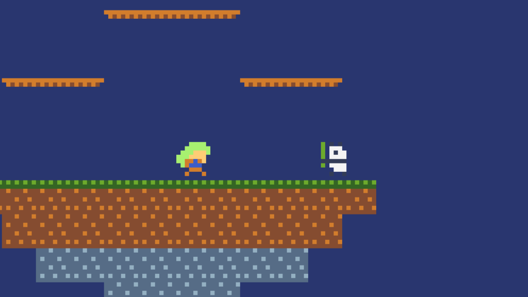
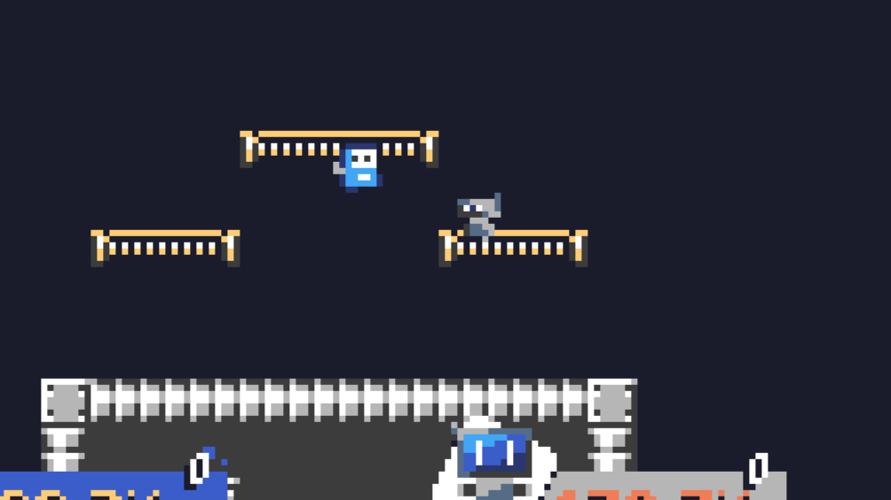

# TIC-Smash

a fighting game available and made with [TIC-80](https://tic80.com).

Game is playable at [TIC-80 website](https://tic80.com/play?cart=4036)

## Screenshots

## To-do

### Planned (v0.8)

- [x] Playable Character
- [x] Non-player character
- [x] Title
- [x] Stage Select
- [x] Character Select
- [x] Timer / Score
- [x] Result

### Ideas / Plans to brush up (v1.0)

- [ ] BGM / SFX / Particles
- [x] More stages
- [ ] More characters (around 12)
- [x] Another special attack
- [ ] ~~Item~~
- [ ] ~~Assist Figure~~
- [ ] ~~Final smash~~

(strikethrough text idea is low possibility due to sprite limits)

## Changelog

each versions saved as .tic format in [Version](./Version) folder

### v0.1

**First release!**

- Bot that automatically fights
- 1 stage
- 2 characters
- some effects / sfx on jumping / smashing
- every character has same special

### v0.4

**more stage / character!**

- 3 stage added
- 2 character added
- each character has own special (wip)
- stage and character is shuffled in each play

### v0.8

**huge update!**

- intro, title added
- stage / character select added (wip)
- option to switch default or stage palette
- added balmung stage and character
- added 1~6 level for bot
- added timer / result on battle (wip)
- can choose character is controlled by bot or player

## Credits

**[Super Smash Bros.](https://www.smashbros.com/) by Nintendo**

| Original                                                    | Developer                                                  | Used Parts                  |
|-------------------------------------------------------------|------------------------------------------------------------|-----------------------------|
|                                                             | [Nesbox](https://tic80.com/dev?id=1)                       | Icon                        |
| [8-BIT Panda](https://tic80.com/play?cart=188)              | [Bruno Oliveira (btco)](https://tic80.com/dev?id=339)      | Character / Tiles / Palette |
| [STELE](https://tic80.com/play?cart=483)                    | [Zus (captainzus)](https://tic80.com/dev?id=1185)          | Character / Tiles / Palette |
| [Balmung](https://tic80.com/play?cart=636)                  | [petet](https://tic80.com/dev?id=1720)                     | Character / Tiles / Palette |
| [MARIO BROS. (Demake)](https://tic80.com/play?cart=223)     | [trelemar](https://tic80.com/dev?id=5)                     | Tiles / Palette             |
| Original MARIO BROS.                                        | Nintendo                                                   |                             |

*Some Sprites / Tiles will shown in-game with another palette depending on situation

## Licenses

| Product                                        | License                                                           |
|------------------------------------------------|-------------------------------------------------------------------|
| [8-BIT Panda](https://tic80.com/play?cart=188) | [Apache License 2.0](https://www.apache.org/licenses/LICENSE-2.0) |

This repository is available under [MIT License](./LICENSE)
